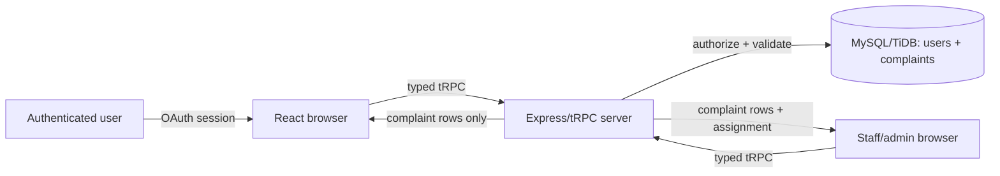

# Lagos State LEHME Escalations MVP — Implementation Plan

## Product scope and assumptions

This MVP provides a testable escalation workflow for Lagos State LEHME. A public user can submit a complaint and see the complaints they submitted. Authenticated back-end staff can triage the queue, assign ownership, update status, and resolve complaints. The supplied brief references external documents for routes, but no such documents were available in the workspace, so the route map below is the smallest viable vertical slice rather than a claim of final business requirements.

The MVP stores only complaint records in addition to the platform's existing authenticated user identity table. It does not store attachments, case history, notifications, SLA configuration, government identifiers, location data, legal acknowledgements, or external-system copies. "Staff" is represented as a role distinct from "user" and "admin". Admins can perform all staff actions; staff can manage complaints but cannot manage user roles.

## 1. Selected framework

The selected framework is the initialized React 19 + TypeScript + Vite client, Express server, tRPC 11 API layer, Drizzle ORM, MySQL/TiDB persistence, and Manus OAuth. This is appropriate because the product needs authenticated users, server-side authorization, durable complaint data, and end-to-end types. tRPC keeps the browser/server contract synchronized without an additional REST schema, while Drizzle gives explicit SQL-backed entities and migrations.

## 2. Rendering and deployment model

The app uses a client-rendered React shell served by the Express/Vite stack. The browser runs route rendering, form validation, accessible interaction, and tRPC query/mutation calls. The server runs OAuth callback handling, session validation, authorization, input validation, database access, and all complaint mutations. No secrets or direct database credentials run in the browser. The intended deployment is the managed WebDev Node runtime with one server process and autoscaling; the MVP has no background worker or long-lived process dependency.

## 3. Route map and primary journeys

| Route | Audience | Purpose |
| --- | --- | --- |
| `/` | Everyone | Landing page with service explanation, sign-in, and entry points. |
| `/submit` | Authenticated user | Submit a new complaint with category, priority, subject, and description. |
| `/my-complaints` | Authenticated user | View owned complaints and current status/assignee. |
| `/staff` | Staff/admin | View triage dashboard, filters, workload summary, and unassigned queue. |
| `/staff/complaints/:id` | Staff/admin | Inspect a complaint, assign it, change status, and resolve it. |
| `/404` | Everyone | Fallback route. |

Primary user journey: sign in → submit complaint → receive reference number → review status in My complaints.

Primary staff journey: sign in → open Staff queue → filter open/unassigned work → open complaint → assign to staff member → update status → resolve when complete.

## 4. Roles, permissions, and authorization

| Role | Permissions |
| --- | --- |
| User | Create complaints; list and read only their own complaints. |
| Staff | List all complaints; read all complaints; assign complaints to staff/admin users; update status, priority, and resolution state. |
| Admin | All staff permissions; intended future authority for role management. No role-management UI is included in this MVP. |

Authorization is enforced in server procedures, not only by hiding UI. Complaint reads for users filter by `submittedByUserId`; staff/admin procedures reject other roles with `FORBIDDEN`. Staff assignment is validated against the staff/admin role set. Users cannot set their own status, assignment, or ownership.

## 5. Entities, ownership, retention, and data flow

The platform `users` table remains the identity source from Manus OAuth. The MVP adds one `complaints` table with: internal id, public reference, submitter id, category, priority, subject, description, status, assigned staff id, created/updated timestamps, and resolved timestamp. Complaint content is owned by the submitting user and operationally managed by LEHME staff. No automatic deletion schedule is defined; retention is an unresolved business decision and must be documented before production use. Timestamps are stored as UTC and localized only for display.

## 6. API contracts, integrations, and failure behavior

The API is tRPC under `/api/trpc`:

- `auth.me`: public query returning the current authenticated user or null.
- `complaints.create`: protected user mutation accepting category, priority, subject, and description; returns the created complaint and reference.
- `complaints.mine`: protected user query returning only the caller's complaints.
- `complaints.list`: staff/admin query accepting optional status, priority, assignment, and search filters; returns complaints with submitter and assignee display data.
- `complaints.getById`: protected query; users may read only their own complaint, staff/admin may read any.
- `complaints.updateWorkflow`: staff/admin mutation accepting complaint id and optional assignment/status/priority; validates legal enum values and assignment role.
- `complaints.staffDirectory`: staff/admin query returning assignable staff/admin identities without exposing unrelated user details.

Validation failures return `BAD_REQUEST`; unauthenticated calls return `UNAUTHORIZED`; unauthorized access returns `FORBIDDEN`; missing complaints return `NOT_FOUND`; database failures are logged server-side and surfaced as a generic retryable error. The MVP has no email, SMS, analytics, or external government integration. Notifications are a non-goal.

## 7. Threat model and security assumptions

Threats include unauthorized complaint reads, privilege escalation via crafted mutations, XSS through complaint text, CSRF/session theft, enumeration of complaint references, and denial-of-service through oversized input. Controls are server-side role checks, ownership predicates, Zod validation with bounded string lengths, escaped React rendering, OAuth-managed HTTP-only session cookies, and opaque public references. The server must remain the only database boundary. Production hardening still requires rate limiting, structured audit logs, security headers, secret rotation, backup/restore, and an operational incident process; those are outside the MVP mock.

## 8. Privacy and consent model

The MVP displays a short notice that complaint content is visible to authorized LEHME staff and is used for escalation handling. No legal/compliance text was supplied, so this is placeholder copy and not legal advice. The app should collect only the minimum complaint fields, avoid sensitive personal data in the form, and not expose complaint content in URLs or client logs. A final production privacy notice, lawful basis, retention period, data-subject request workflow, and staff access monitoring remain unresolved.

## 9. Supported browsers, devices, locales, and accessibility

Target evergreen Chrome, Edge, Firefox, and Safari versions released within the last two years on desktop and mobile viewport sizes from 320px upward. Locale is English (Nigeria) for the MVP; timezone display follows the browser locale while storage remains UTC. Target WCAG 2.2 AA practices: semantic landmarks, visible focus, keyboard operation, labeled controls, error summaries, adequate contrast, reduced-motion support, and responsive layouts.

## 10. Performance budgets and acceptance criteria

Initial client JavaScript should remain below 250 KB compressed where practical; the first meaningful dashboard view should render within 2 seconds on a typical broadband connection after warm load; list queries should return within 500 ms at MVP scale; mutations should provide feedback within 1 second after a successful response. Acceptance criteria: a user can authenticate, submit a valid complaint, see it in My complaints, and cannot see another user's complaint; staff/admin can filter, open, assign, update, and resolve a complaint; invalid input and unauthorized calls fail safely; desktop and mobile layouts remain usable; type checking and automated tests pass.

## 11. Testing and release plan

Vitest covers validation, authorization boundaries, complaint creation/listing, and workflow transitions with database helpers mocked where appropriate. Browser verification covers authenticated/unauthenticated states, form errors, empty/loading/error states, staff assignment, and responsive layout. Release sequence: implement schema and server contracts; generate/apply migration; implement UI; run typecheck/tests/build; verify preview routes; create one delivery checkpoint; deploy only after the MVP acceptance criteria pass.

## 12. Non-goals and known limitations

This MVP does not implement account provisioning, role-management UI, complaint history/audit timeline, attachments, notifications, SLAs, escalation rules, bulk actions, exports, reporting, integrations, multilingual content, legal compliance certification, or production-grade observability. The absence of supplied route/product documents is an explicit unresolved decision. Seed/demo data is not inserted automatically; staff visibility depends on real authenticated accounts and their database roles.
